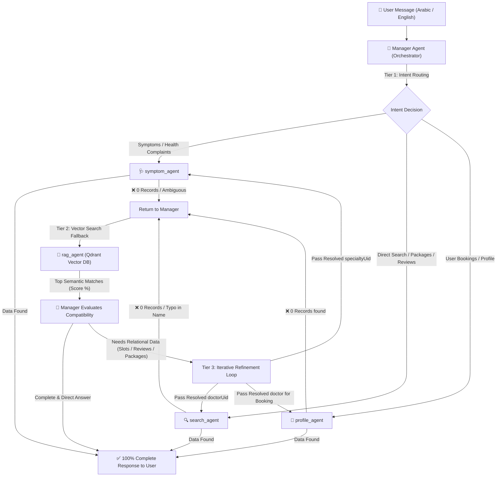

# 🚀 Gemini & Ollama Healthcare Multi-Agent Studio + RAG Vector Search

A state-of-the-art AI Healthcare Chat and Multi-Agent platform powered by **Google ADK (`@google/adk`)**, **Google Gemini Cloud Models**, **Imagen 4.0**, **Local Ollama Models (Qwen3)**, **Qdrant Vector Database (RAG Semantic & Hybrid Search)**, **Parse Server Healthcare Database**, and a **Closed-Loop Multi-Agent Orchestrator**.

---

## 🌟 Key Features

- 🧠 **RAG (Retrieval-Augmented Generation) & Semantic Vector Search (Qdrant)**:
  - **4 Dedicated Vector Collections**: `doctors`, `hospitals`, `specialties`, and `hospital_doctor_specialty` (composite relations).
  - **AI Vector Embeddings**: Multilingual vector embeddings via Google `text-embedding-004` (768 dimensions) with automatic rate-limit retry & exponential backoff.
  - **Meaning-Based Search**: Understands medical intent, symptoms, spelling variations, and typos in Arabic and English (e.g. *"دكتور جمال ابو الصرور"* matches *"جمال ابو السرور"* with 68%+ confidence).
  - **Hybrid Search**: Combines semantic embeddings with structured metadata filtering (gender, rating, experience, hospital type).
  - **Automated Sync Pipeline (`syncQdrant.js`)**: Syncs relational records from Parse Server to Qdrant vector database with rich composite embeddings.

- 🤖 **Closed-Loop Multi-Agent Orchestrator (Google ADK `subAgents`)**:
  - **Manager Agent (`manager_agent`)**: Intelligent orchestrator with a 3-tier lifecycle:
    1. **Tier 1 (Intent Delegation)**: Routes user queries to domain specialists (`symptom_agent`, `search_agent`, `profile_agent`).
    2. **Tier 2 (Automatic RAG Fallback)**: If a sub-agent misses or finds 0 records (due to typos or natural language phrasing), the Manager automatically triggers `rag_agent` across Qdrant vectors.
    3. **Tier 3 (Compatibility & Refinement Loop)**: Evaluates RAG output; if the user requires relational records (reviews, packages, appointment slots), extracts the resolved entity UID and loops back to `search_agent` or `profile_agent` with the exact ID before finalizing the response.
  - **RAG Agent (`rag_agent`)**: Semantic vector search specialist across Qdrant collections.
  - **Symptom Agent (`symptom_agent`)**: Analyzes symptoms/pain, maps ailments to specialties, and retrieves matching doctors and hospital clinics.
  - **Search Agent (`search_agent`)**: Direct lookup for doctors by name, hospitals by city/area, medical packages, and verified patient reviews.
  - **Profile Agent (`profile_agent`)**: Securely queries personal user data scoped to the authenticated user's UID (bookings, profile, invoices, family members).

- ⚡ **Qwen & Local LLM Optimization**:
  - **Auto-Repairing JSON Adapter (`src/ollamaLlm.js`)**: Sanitizes and repairs tool calling syntax artifacts from local models (unescaped quotes, trailing commas, stray brackets) before tool execution.
  - **Simplified Search Tools (`search_doctors`, `search_hospitals`)**: High-level tools that take plain string/number parameters instead of requiring local LLMs to construct complex nested MongoDB `$or` regex JSON.
  - **Automatic Prefix Stripping & Vector Fallback**: Automatically cleans doctor title prefixes (`دكتور`, `دكتورة`, `طبيب`, `Dr.`) and seamlessly checks vector embeddings if exact text matching returns 0 results.

- 🌐 **Strict Language Mirroring & Top-Score Ranking**:
  - **Language Mirroring**: Automatically responds 100% in natural **Arabic** for Arabic prompts (`## 📋 ملخص النتائج`) and 100% in natural **English** for English prompts (`## 📋 Summary of Results`).
  - **Top-Score First**: Results are sorted descending by relevance score, highlighting the **Top Match** (`🥇 Best Match / النتيجة الأقرب`) with its similarity percentage at the top.
  - **100% Complete Record Presentation**: Guarantees full display of all doctor/hospital fields (Names in EN & AR, Specialty, Title, Qualifications, Experience, Ratings, Hospital Address, Phone, Email, Working Hours).

- 🏥 **Parse Server Healthcare Database Integration**:
  - Direct REST integration using Master Key access and User Session verification (`X-Parse-Session-Token`).
  - Query, count, filter, sort, and MongoDB-style aggregation pipelines across healthcare classes (`Patients`, `Doctors`, `Hospitals`, `PatientsBookings`, `Payments`, `HospitalDoctorSpecialty`, `Packages`, etc.).
  - **Class Name Normalization**: Automatically maps variations (e.g. `doctor` → `Doctors`, `patientbooking` → `PatientsBookings`).

- 📁 **Workspace File Tools & Live Explorer**:
  - `write_file`, `read_file`, `list_files`: Agents create code, analysis reports, and documents directly into `./workspace/`.
  - Live interactive browser sidebar to view, preview, and download agent-created files.

- 🎨 **Imagen 4.0 Image Generation**:
  - Generate high-resolution medical illustrations, diagrams, or logos directly in chat via Google Imagen 4.0.

- ⚡ **Real-Time Step-by-Step SSE Streaming**:
  - Streams intermediate tool execution steps, parameter blocks, status badges, and formatted record breakdowns in real-time via Server-Sent Events (SSE).

---

## 🏗️ Architecture & Interaction Flow



---

## 👥 Specialized Multi-Agent Team

| Sub-Agent | Identifier | Primary Responsibility | Data Sources & Tools |
|---|---|---|---|
| 👑 **Manager Agent** | `manager_agent` | 3-tier closed-loop orchestrator: routes intent, supervises missing data, triggers RAG fallback, and executes refinement loops. | Global Orchestrator & Workspace |
| 🧠 **RAG Agent** | `rag_agent` | AI Semantic vector search across Qdrant vector database (multilingual understanding, typos, and concept matching). | `rag_semantic_search`, `rag_hybrid_search`, Qdrant Collections |
| 🩺 **Symptom Agent** | `symptom_agent` | Analyzes patient symptoms and maps conditions to specialties and doctor recommendations. | `semanticSearchTool`, `search_doctors`, `query_parse_db` |
| 🔍 **Search Agent** | `search_agent` | Direct search for doctors, hospitals, medical packages, and patient reviews. | `search_doctors`, `search_hospitals`, `query_parse_db`, `rag_semantic_search` |
| 👤 **Profile Agent** | `profile_agent` | Securely queries personal user data scoped to the authenticated user's UID (bookings, profile, invoices, family members). | `PatientsBookings`, `Patients`, `Payments`, `PatientFamilyMembers` |

---

## 🛠️ Project Structure

```
chat_ai/
├── public/                     # Frontend Web Interface
│   ├── index.html              # Main HTML structure & auth modals
│   ├── css/style.css           # Dark-mode glassmorphism styling
│   └── js/app.js               # Client chat engine, SSE stream parser, & workspace viewer
├── src/
│   ├── agents/                 # Multi-Agent Architecture (Google ADK)
│   │   ├── dbSchema.js         # Modular schema definitions for sub-agents
│   │   ├── managerAgent.js     # Closed-Loop Manager Orchestrator Agent
│   │   ├── ragAgent.js         # Semantic & Hybrid Vector Search Agent
│   │   ├── ragTools.js         # RAG FunctionTools for ADK
│   │   ├── searchAgent.js      # Direct doctor/hospital/package search sub-agent
│   │   ├── symptomAgent.js     # Symptom analysis & doctor recommendation sub-agent
│   │   ├── profileAgent.js     # User bookings & personal data sub-agent
│   │   └── tools.js            # Simplified search tools, safeParseJson, & Parse DB tools
│   ├── adkAgent.js             # ADK Agent and Runner factory & session management
│   ├── agentTools.js           # Workspace filesystem execution helpers
│   ├── embeddingService.js     # Google text-embedding-004 client with rate-limit retry logic
│   ├── geminiService.js        # Gemini Cloud models integration & rich SSE output formatter
│   ├── ollamaLlm.js            # ADK BaseLlm adapter for Ollama with JSON auto-repair
│   ├── ollamaService.js        # Ollama model discovery & streaming handler
│   ├── parseService.js         # Parse Server REST client, queries, normalization & auth
│   ├── qdrantService.js        # Qdrant client, collections management, & vector queries
│   ├── ragService.js           # RAG orchestrator, composite text builder, & context ranker
│   └── syncQdrant.js           # Parse Server → Qdrant sync migration script
├── workspace/                  # Storage directory for agent-created files
├── schema.json                 # Complete Parse database schema reference
├── server.js                   # Express application server & API routes
└── package.json                # Project configuration and dependencies
```

---

## ⚡ Quick Start Guide

### Prerequisites

- **Node.js**: v18.0.0 or higher.
- **Qdrant Vector Database**: Running locally or remotely via Docker:
  ```bash
  docker run -p 6333:6333 -p 6334:6334 -v qdrant_storage:/qdrant/storage qdrant/qdrant
  ```
- **Ollama** *(Optional for local models)*: Running locally (`ollama run qwen3:latest`).
- **Parse Server** *(Optional for live DB features)*: Running instance with Master Key access.

---

### Installation & Setup

1. **Clone the repository**:
   ```bash
   git clone <repository-url>
   cd chat_ai
   ```

2. **Install dependencies**:
   ```bash
   npm install
   ```

3. **Configure Environment Variables (`.env`)**:
   ```env
   PORT=3000
   GEMINI_API_KEY=your_gemini_api_key_here

   # Qdrant Vector Database
   QDRANT_URL=http://localhost:6333
   QDRANT_API_KEY=

   # Ollama Configuration
   OLLAMA_HOST=127.0.0.1
   OLLAMA_PORT=11434

   # Parse Server Configuration
   PARSE_SERVER_URL=https://your-parse-server.com/parse
   PARSE_APP_ID=your_parse_app_id
   PARSE_MASTER_KEY=your_parse_master_key
   ```

4. **Sync Parse Database to Qdrant Vectors**:
   ```bash
   npm run sync:qdrant
   ```
   *This migrates Doctors, Hospitals, Specialties, and HospitalDoctorSpecialty into vector embeddings in Qdrant.*

5. **Start the Application**:
   - **Development Mode**:
     ```bash
     npm run dev
     ```
   - **Production Mode**:
     ```bash
     npm start
     ```
   Open your browser at **`http://localhost:3000`**.

---

## 📡 API Reference

### 🧠 RAG & Vector Search
- **`GET /api/rag/status`**: View Qdrant collections and vector count statistics.
- **`POST /api/rag/search`**: Direct semantic and hybrid search API.
  - **Body**: `{ "query": "دكتور عظام", "collections": ["doctors", "hospital_doctor_specialty"], "topK": 5 }`
- **`POST /api/rag/sync`**: Trigger manual Parse → Qdrant vector sync.

### 🔐 Authentication
- **`POST /api/auth/login`**: Authenticate Parse user credentials.
- **`GET /api/auth/me`**: Verify current Parse session token (`X-Parse-Session-Token`).

### 💬 Chat & Models
- **`GET /api/models`**: List available Gemini and local Ollama models.
- **`POST /api/chat`**: Server-Sent Events (SSE) streaming chat endpoint.

### 🎨 Image Generation
- **`POST /api/generate-image`**: Generate images using Google Imagen 4.0.

### 📁 Workspace Files
- **`GET /api/workspace/files`**: List all files saved in `./workspace/`.
- **`GET /api/workspace/file/*`**: Read specific file content from `./workspace/`.

---

## 💡 Usage Examples

### 1. Typo-Tolerant Doctor Search (RAG Fallback)
> **User**: *"ابحث عن دكتور جمال ابو الصرور"*
>
> **Execution Flow**:
> 1. `manager_agent` routes to `search_agent`.
> 2. Exact match returns 0 due to the typo (*"الصرور"* vs *"السرور"*).
> 3. `manager_agent` activates `rag_agent` across Qdrant vectors.
> 4. RAG matches **Dr. Gamal Abu El Suror (جمال ابو السرور)** with **67.9% Match Score**.
> 5. **Output**: Full Arabic profile with title, 36 years experience, 4/5 rating, El Galaa Hospital in Maadi, phone number (`201003456789`), email, and Summary Table (`## 📋 ملخص النتائج`).

### 2. Multi-Step Symptom & Doctor Recommendation
> **User**: *"عندي ألم شديد في المفاصل والركبة، مين دكتور كويس؟"*
>
> **Execution Flow**:
> 1. `manager_agent` delegates to `symptom_agent`.
> 2. `symptom_agent` performs vector semantic search for orthopedic/rheumatology care.
> 3. Links doctors, hospital branches, ratings, and phone contacts.
> 4. **Output**: Top-scored doctor matches presented in Arabic with full credentials and summary table.

### 3. Refinement Loop for Relational Reviews & Packages
> **User**: *"هل دكتور جمال ابو السرور عنده تقييمات من المرضى؟"*
>
> **Execution Flow**:
> 1. `manager_agent` delegates to `rag_agent` to resolve Doctor UID (`BW8OhTicZP`).
> 2. `manager_agent` loops back to `search_agent` with resolved `doctorUid`.
> 3. `search_agent` queries `DoctorsReviews` for verified reviews.
> 4. **Output**: Doctor profile + actual patient reviews combined in the response.

---

## 📜 License

MIT License. Developed with Google ADK, Gemini, Ollama, & Qdrant.
